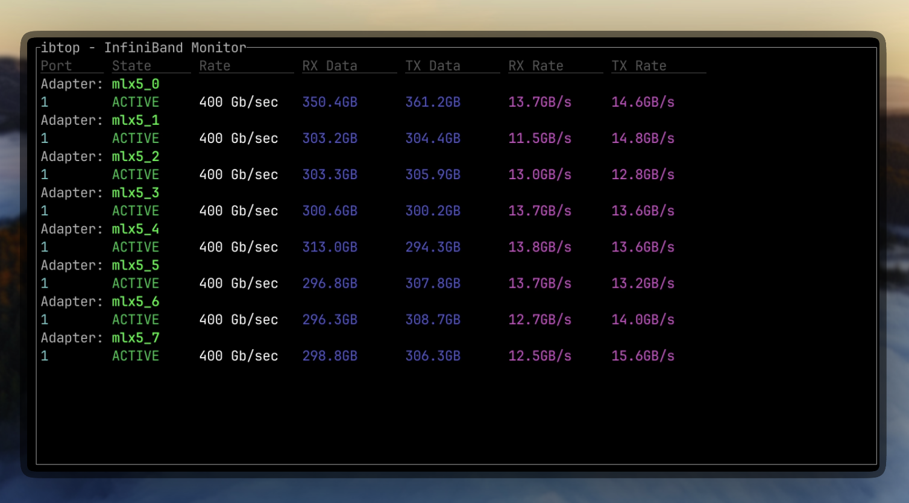

# ibtop

Real-time terminal monitor for InfiniBand networks - htop for high-speed interconnects




## Installation

### Quick Install (Recommended)

```bash
# Install the latest release automatically
curl -fsSL https://raw.githubusercontent.com/JannikSt/ibtop/main/install.sh | bash
```

### Install from crates.io

```bash
# Install using cargo
cargo install ibtop
```

### Manual Installation

```bash
# Download the latest release for your architecture
# For x86_64:
wget https://github.com/JannikSt/ibtop/releases/latest/download/ibtop-linux-amd64
# For arm64:
wget https://github.com/JannikSt/ibtop/releases/latest/download/ibtop-linux-arm64

chmod +x ibtop-linux-*
sudo mv ibtop-linux-* /usr/local/bin/ibtop
```

### From Source

```bash
# Clone the repository
git clone https://github.com/JannikSt/ibtop.git
cd ibtop

# Build and install
cargo build --release
sudo cp target/release/ibtop /usr/local/bin/
```

## Usage

```bash
# Monitor all InfiniBand adapters
ibtop
```

### Controls

- `q` or `ESC` - Quit

## Requirements

- Linux system with InfiniBand sysfs (`/sys/class/infiniband/`)
- Terminal with color support
- Rust 1.70+ (for building from source)

## Compatibility

- **Mellanox mlx5** - Fully tested, counters use 32-bit word units
- **Mellanox mlx4** - Expected to work (same counter format)
- **Intel/Cornelis** - May require adjustments for hw_counters path
- **Other IB adapters** - Should work if they follow standard sysfs layout

## License

Apache License 2.0

## Development

### Pre-commit Hooks

This project uses pre-commit hooks to ensure code quality. To set them up:

```bash
# Install pre-commit
pip install pre-commit

# Install the git hook scripts
pre-commit install
```

The hooks will automatically run `cargo fmt` and `cargo clippy` before each commit.

## Contributing

Contributions are welcome! Please feel free to submit a Pull Request.
